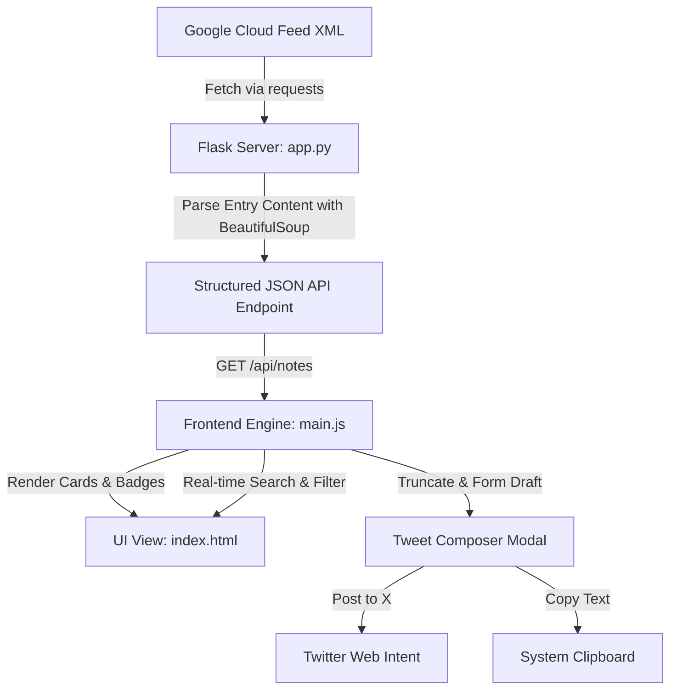

# Implementation Plan: BigQuery Release Notes Explorer

This document outlines the architecture, components, file structure, and technical features implemented for the **BigQuery Release Notes Explorer & Share** web application.

---

## 1. Project Architecture

The application is structured as a lightweight Python Flask web service paired with a modern, single-page reactive frontend built using pure vanilla web technologies.

---

## 2. File Structure

All components are modularized in the following directory layout under the `bigquery-release-app/` workspace:

*   **[app.py](file:///C:/Users/HP/bigquery-release-app/app.py)**: Python application runner. Handles RSS downloading, HTML sub-topic segmentation, and standard caching policies.
*   **[templates/index.html](file:///C:/Users/HP/bigquery-release-app/templates/index.html)**: Main HTML structure utilizing semantic elements and containing the modal layout.
*   **[static/css/style.css](file:///C:/Users/HP/bigquery-release-app/static/css/style.css)**: Vanilla CSS file housing UI styling, theme layouts, animation keyframes, and custom highlights.
*   **[static/js/main.js](file:///C:/Users/HP/bigquery-release-app/static/js/main.js)**: State controller containing feed retrievers, DOM event listeners, search/filter algorithms, and length calculations.
*   **[requirements.txt](file:///C:/Users/HP/bigquery-release-app/requirements.txt)**: Python package dependency manifest.

---

## 3. Core Features Implemented

### A. Sub-Topic Entry Segmentation
Google Cloud's release feeds combine multiple sub-updates (e.g. `Feature`, `Issue`, `Announcement`) into a single daily entry. The backend extracts them:
1.  Downloads the Atom feed and initializes a BeautifulSoup parser on each entry `<content>` tag.
2.  Iterates through child nodes, splitting contents sequentially on each header `<h3>` element.
3.  Transforms each segment into a distinct update item complete with custom category badges and direct URL anchor links.

### B. Premium Responsive Design System
The frontend is built using standard visual aesthetics:
*   **Color Palette**: Harmonious dark mode (`#0a0d16` base) utilizing glassmorphic backdrop filters (`rgba(17, 24, 39, 0.65)` with `blur(10px)`) and glowing colored border accents mapped directly to update categories (e.g., Features get emerald borders; Issues get amber/crimson borders).
*   **Fonts**: Custom typography imported dynamically from Google Fonts (`Outfit` for headings, `Inter` for content text).
*   **Micro-Animations**: Elevating translation cards on hover and rotating loading icons for visual feedback.

### C. Live Search and Category Filters
*   **Search**: Evaluates text queries in real-time across category names, dates, and clean HTML content strings.
*   **Type Dropdown**: Narrows down feed lists instantly by Feature, Issue, Change, Announcement, or Breaking Change.

### D. Integrated Tweet Composer
*   **Safe Length Truncation**: Auto-detects HTML and parses raw text. Truncates description bodies to leave room for category titles, headers, and the direct release note anchor URL, guaranteeing the final string remains below **280 characters**.
*   **SVG Character Counter**: An animated circular progress indicator that maps current tweet length. The ring color scales from blue (healthy) to yellow (nearing limit) to red (exceeded) along with text input events.
*   **One-Click Sharing**: Direct integration with the native Twitter Intent URL format:
    `https://twitter.com/intent/tweet?text=[TEXT]`
*   **Clipboard Buffer**: An option to copy formatted text drafts directly to clipboard with pop-up toast confirmations.

---

## 4. Next Steps & Optimizations

If the application is scaled further, the following additions can be made:
*   **Persistent SQLite Storage**: Store fetched notes in a local database to speed up page loads and allow offline access.
*   **Automated Twitter OAuth Flow**: Transition from Web Intents to an API-based scheduler to queue or schedule posts directly from the panel.
*   **Filter Preferences**: Persist search filters or favorite updates using browser `localStorage`.
